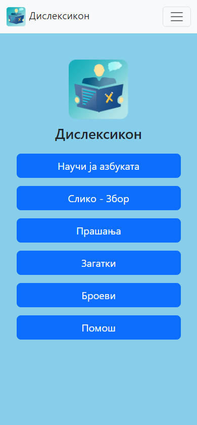
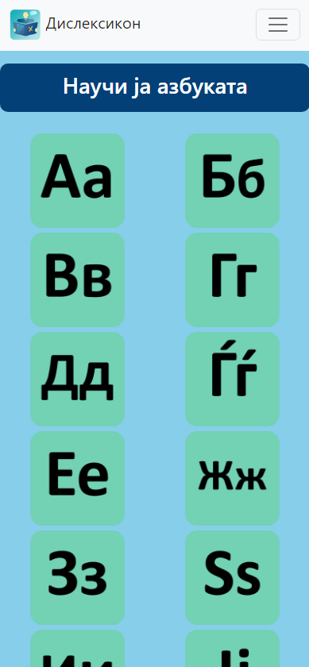
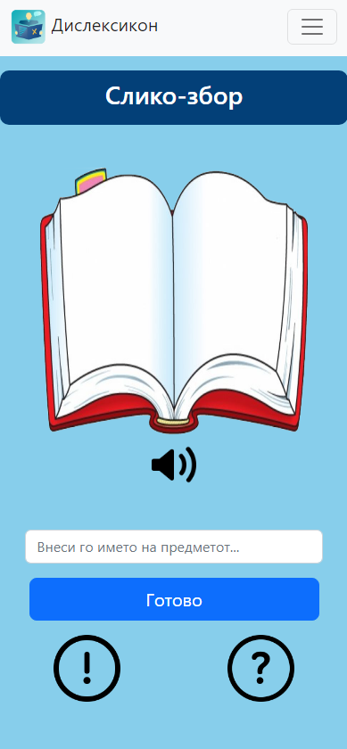
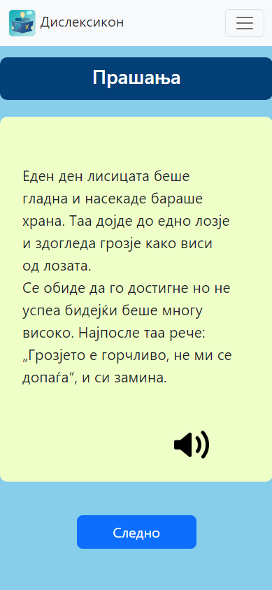
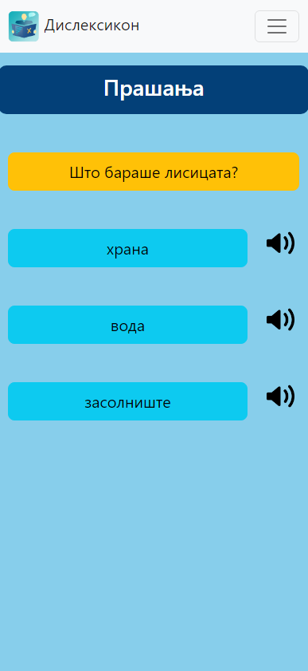
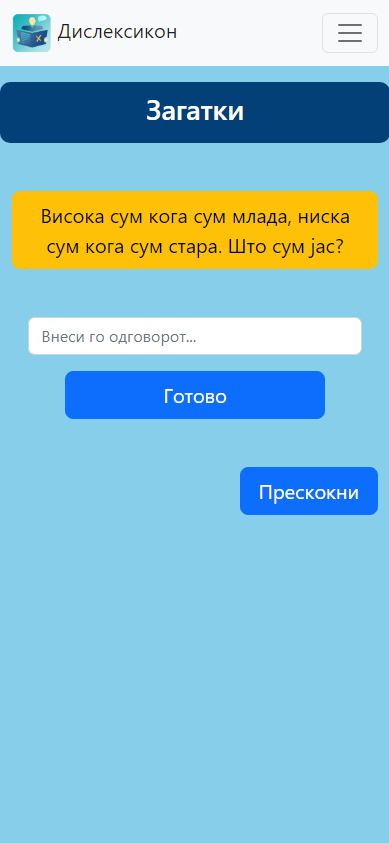
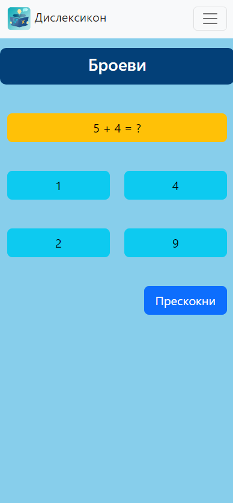
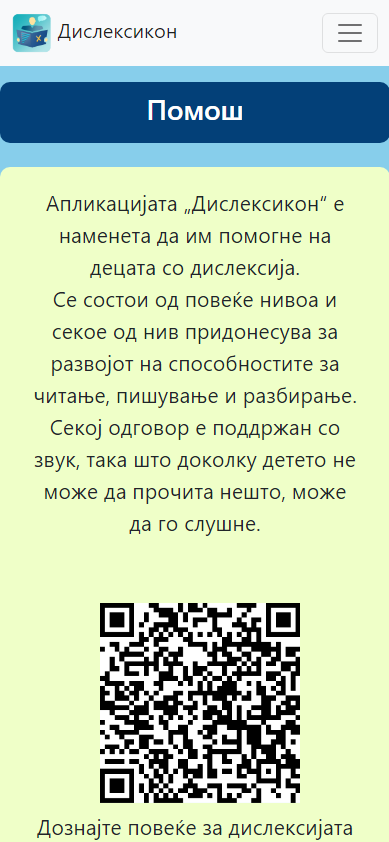

 
  

# Дислексикон
*Апликација наменета за да им помогне на децата со дислексија*
___
## Опис на апликацијата
Апликацијата Дислексикон претставува веб апликација
наменета да служи како помагало за децата со дислексија.
Со оглед на содржината на апликацијата, истата е наменета
за деца но може да се користи и од возрасни.
 
Апликацијата е составена од неколку дела, односно
нивоа, и притоа секој дел е прилагоден за крајните корисници - децата со дислексија.
Секое ниво има посебна функционалност и цел како да им
помогне на децата кои страдаат од оваа попреченост.
  
## Користени технологии
* Java
* Spring Boot
* JQuery
* REST API
* Bootstrap
* H2 Database
* HTML/CSS/JS

## Функционалности
* нивоа кои го стимулираат учењето, разбирањето и пишувањето
* секој одговор е проследен со звук и е јасно обележан за полесно разбирање
* проверка дали одговорот е точен и нудење помош на корисникот доколку истиот има проблем со прашањето
* забавни загатки и прашања кои ќе го стимулираат детето да учи 

## Изработил
* Страшо Наумов
    * strase10naumov@outlook.com
    * strasho.naumov@students.finki.ukim.mk

## Слики од апликацијата
*Почетна*  

 
*Научи ја азбуката*  
 
 
*Слико-збор*  

 
*Прашања - текст*  

 
*Прашања - одговори*  

 
*Загатки*  

 
*Броеви*  
 
 
*Помош*  

